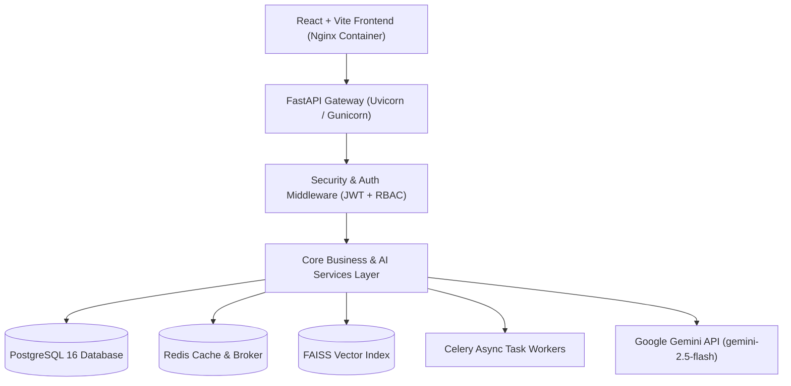

# System Architecture & Design

The AI Classroom Assistant follows a strict enterprise Repository → Service → API architecture pattern adhering to SOLID principles.

---

## High-Level Architecture Diagram

---

## Architectural Principles

1. **Decoupled Business Logic**: API endpoints delegate request processing exclusively to Service classes.
2. **Replaceable AI Providers**: Abstract base interfaces enable switching from Google Gemini to OpenAI or Ollama.
3. **Pluggable Similarity Engine**: Abstract Base Class `PlagiarismProvider` supports local embeddings or third-party APIs.
4. **Transaction Safety**: All database modifications execute within scoped async sessions with automatic rollback on errors.
